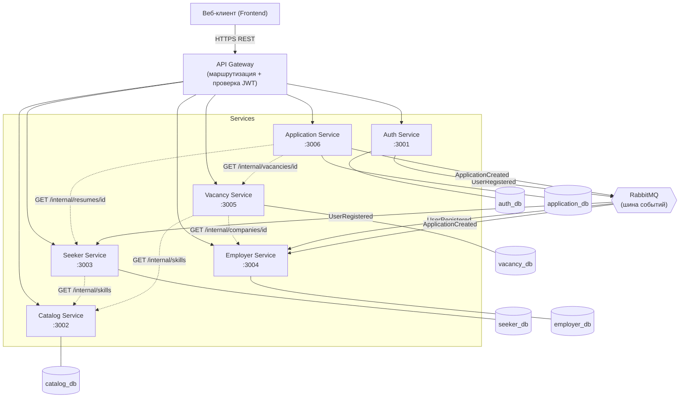

# Микросервисная архитектура JobSite

## Схема сервисов и взаимодействия

> Сплошные стрелки — владение БД и маршрутизация Gateway. Пунктирные — синхронные
> REST-вызовы внутреннего API (`/internal`). Стрелки через RabbitMQ — асинхронные события.

## Разделение БД (database-per-service)

| Сервис | Своя БД | Таблицы |
|---|---|---|
| Auth Service | `auth_db` | users |
| Catalog Service | `catalog_db` | skills, industries |
| Seeker Service | `seeker_db` | job_seekers, resumes, work_experiences, educations, resume_skills |
| Employer Service | `employer_db` | employers, companies |
| Vacancy Service | `vacancy_db` | vacancies, vacancy_skills, saved_vacancies |
| Application Service | `application_db` | applications |

Связи между сервисами хранятся как внешние идентификаторы (`company_id`, `vacancy_id`,
`resume_id`, `user_id`) без внешних ключей на чужие БД. Целостность обеспечивается на
уровне приложения (валидация через `/internal`-вызовы) и принципом eventual consistency.

## Способы взаимодействия

### Синхронные (REST, внутренний API `/internal`)
Когда нужен немедленный ответ:
- **Vacancy → Employer**: при создании вакансии проверить, что `company_id` существует
  и принадлежит работодателю (`GET /internal/employers/{id}/company`).
- **Vacancy/Seeker → Catalog**: получить названия навыков по `skill_ids`.
- **Application → Vacancy**: проверить существование вакансии при отклике.
- **Application → Seeker**: проверить, что резюме существует и принадлежит соискателю.

### Асинхронные (события через RabbitMQ)
Для слабосвязанных реакций (тема ДЗ5):
- **UserRegistered** (publisher: Auth) → Seeker/Employer создают пустой профиль под нового пользователя.
- **ApplicationCreated** (publisher: Application) → Employer/уведомления получают сигнал о новом отклике.

## API Gateway
Единая точка входа: проверяет JWT (через `POST /internal/users/verify-token` Auth-сервиса),
маршрутизирует запросы по сервисам, скрывает внутреннюю топологию от клиента. Публичный
контракт для клиента не меняется — остаётся API из ДЗ2.
